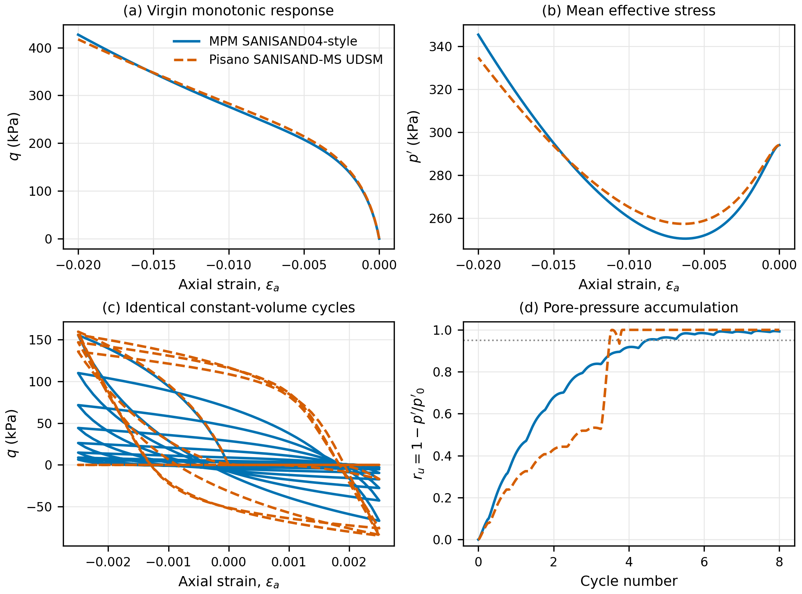
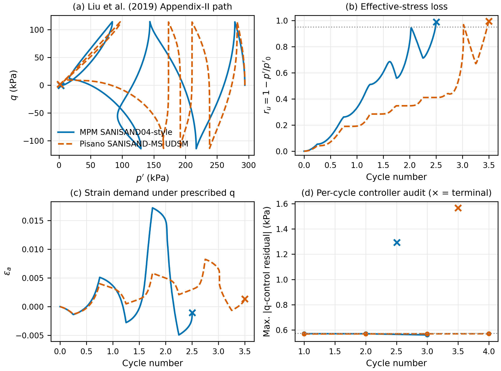

# Constitutive-model verification and validation subsection

## X.X Verification and qualified validation of the sand constitutive model

### X.X.1 Model identity and independent reference

The sand model used in the coupled MPM calculations was first audited at the
source-code and state-variable levels. The implementation contains the yield
back-stress ratio, its reversal value, a fabric tensor, accumulated equivalent
plastic strain and void ratio (20 restart variables in total). This structure
is consistent with a Dafalias--Manzari-type SANISAND model in which fabric
affects post-dilation contraction [Dafalias and Manzari
(2004)](https://doi.org/10.1061/%28ASCE%290733-9399%282004%29130%3A6%28622%29).
It does not contain the centre and radius of a memory surface. It is therefore
identified below as **MPM SANISAND04-style**, rather than SANISAND-MS.

An independent numerical reference was obtained from the
[SANISAND-MS UDSM repository maintained by Pisanò and
co-workers](https://github.com/FedericoPisano/SANISAND-MS-UDSM), fixed at
commit `205c13b0a8fe5ffdcc1404b6fe63a59a67e613b9`. The UDSM stores 31 state
variables, including the memory-surface centre, its positive and negative
radius components, and the yield-surface reversal state. These are the
distinguishing variables introduced by the memory-enhanced formulation of
[Liu et al. (2019)](https://doi.org/10.1680/jgeot.17.P.307). The reference
source was compiled separately in a temporary directory and was never linked
into the MPM executable. The committed upstream bytes, compiler, compatibility
edit, both local drivers, executables, raw CSV files and figures were recorded
by SHA-256. This procedure avoided both a common-code oracle and the inclusion
of GPL-licensed reference source in the present repository.

This distinction is important for reproducibility. The public OpenSees
documentation likewise exposes `alphaM` and `MM` as SANISAND-MS recorder
variables and notes that its integration equations include implementation
modifications relative to Liu et al. (2019) ([OpenSees SANISAND-MS
documentation](https://opensees.github.io/OpenSeesDocumentation/user/manual/material/ndMaterials/SAniSandMS.html)).
The OpenSees implementation was therefore used only as a formulation and
nomenclature cross-check, not as a second quantitative oracle.

### X.X.2 Parameters, loading paths and acceptance criteria

The validation state and material constants follow Appendix II and Table A1
of Liu et al. (2019): Toyoura sand was initialized at
\(p'_0=294\ \mathrm{kPa}\) and \(e_0=0.808\), with
\(G_0=125\), \(\nu=0.05\), \(M_c=1.25\), \(c=0.712\),
\(\lambda_c=0.019\), \(e_{c0}=0.934\), \(\xi=0.7\),
\(m=0.01\), \(h_0=7.05\), \(c_h=0.968\), \(n_b=1.1\),
\(A_0=0.704\), and \(n_d=3.5\). For the memory-surface reference,
\(\mu_0=45\), \(\zeta=10^{-5}\), and \(\beta=16.5\) reproduce the
settings reported for Fig. A2(b). The MPM implementation uses a different
critical-state-line and bulk-modulus parameterization. Its three
critical-state constants were least-squares mapped to
\(e_c=0.934-0.019(p'/p_{atm})^{0.7}\) over 10--500 kPa, giving
\(N_c=2.1625334\), \(\Lambda=0.0662446\), and
\(\alpha_c=333.425\ \mathrm{kPa}\); \(K_0=93.84984\) matches
\(\nu=0.05\) at the initial state. These mappings were fixed before the model
comparison and their residual was retained as part of the validation error.

Three single-material-point paths were imposed:

1. virgin constant-volume triaxial compression to
   \(\varepsilon_a=-2\%\), used for direct code-to-code verification before
   repeated memory-surface loading dominates;
2. eight identical triangular constant-volume strain cycles with
   \(|\varepsilon_a|=0.25\%\), used to discriminate the cyclic mechanisms
   under exactly the same strain history; and
3. the Appendix-II mixed-control test with
   \(q_{ampl}=114.2\ \mathrm{kPa}\), 400 target increments per cycle and
   zero volumetric strain. This reproduces the published boundary condition;
   the path was terminated explicitly when the constitutive response could no
   longer meet the prescribed \(q\) within 0.5% of its amplitude.

Both drivers were run with stress/integration tolerances of \(10^{-5}\) and
\(10^{-7}\). Before seeing the tight-tolerance result, numerical convergence
was defined as a maximum loose--tight difference below 1% after normalisation
by \(p'_0\) or \(q_{ampl}\). The mapped virgin responses were accepted only
if the maximum current/reference difference was below 10%. Every reported
curve uses the raw material-point output; no numerical or display smoothing
was applied.

### X.X.3 Results

All six loose--tight comparisons for each implementation passed the 1%
convergence criterion. The largest normalised difference was 0.870% for the
MPM mixed-control path and 0.258% for the reference UDSM. Under virgin
monotonic loading, the maximum normalised differences between the two models
were 3.62% in \(p'\) and 8.58% in \(q\); the corresponding normalised RMSEs
were 1.80% and 4.74%. Thus, after the declared parameter mapping, the current
implementation reproduces the independent reference response during virgin
loading within the predeclared 10% limit (Fig. X1a,b).

The cyclic paths deliberately produced a different result. Under the common
strain history, the UDSM reached \(r_u=1-p'/p'_0=0.95\) at cycle 3.500,
whereas the MPM model reached the same threshold at cycle 4.488. This comparison
does **not** imply greater cyclic resistance of the MPM model: the two models
mobilised different cyclic deviator stresses under the imposed strain. In the
experimentally relevant stress-controlled test, the ordering reversed. The
MPM model reached its audited controller terminal at cycle 2.505,
\(p'=3.060\ \mathrm{kPa}\), and \(r_u=0.9896\). The SANISAND-MS UDSM
continued to cycle 3.500, \(p'=1.770\ \mathrm{kPa}\), and
\(r_u=0.9940\), extending the prescribed-stress response by 0.995 cycle
(Fig. X2). The apparent reversal between strain and stress control is therefore
a boundary-condition effect: the MPM model progressively shed cyclic stress
under a fixed strain amplitude, but required a larger strain demand and
reached its terminal state earlier when \(q\) was prescribed.

The stress-path topology and delayed terminal response of the independent UDSM
are consistent with the role assigned to the memory surface in Appendix II of
Liu et al. (2019): it regulates post-reversal pore-pressure accumulation and
cyclic strain demand. The comparison is code-to-code quantitative validation
plus a literature-condition reproduction; it is not presented as a new fit to
the Ishihara et al. experimental data because machine-readable observations
were not available from the cited repository.

### X.X.4 Consequence for the pipeline calculations

The constitutive evidence supports use of the current implementation as a
numerically stable, pressure-dependent, fabric-enhanced **SANISAND04-style**
model. It also places a strict limit on the paper's model claim. The pipeline
results may attribute differences from Mohr--Coulomb to state-dependent
stiffness, contractancy/dilatancy, back-stress evolution and the fabric tensor.
They must not attribute those differences to a SANISAND-MS memory surface,
ratcheting-to-shakedown transition or the variables \(\alpha^M\) and
\(m^M\), because those mechanisms are absent from the production model.

A future production `SANISAND-MS2D` model would require the full memory-surface
state, its translation/contraction laws and restart serialization, followed by
the same two-tolerance material-point validation and a new coupled-pipeline
sensitivity study. The present qualified validation is sufficient for the
more limited claim used here: relative to Mohr--Coulomb, the adopted
SANISAND04-style law resolves cyclic state dependence and fabric-mediated
stress-path effects, but it is not numerically equivalent to SANISAND-MS.

### Figure captions



**Figure X1.** Independent material-point verification under the Toyoura
initial state: (a) virgin \(q\)--\(\varepsilon_a\) response, (b) mean
effective stress, (c) eight identical constant-volume cycles, and (d) pore-
pressure ratio. Solid blue: present MPM SANISAND04-style implementation;
dashed orange: commit-pinned Pisano SANISAND-MS UDSM. Raw output is shown
without smoothing.



**Figure X2.** Reproduction of the Liu et al. (2019) Appendix-II loading
condition: (a) \(q\)--\(p'\) paths, (b) effective-stress loss, (c) axial
strain demand under prescribed \(q\), and (d) maximum accepted controller
residual per cycle. Crosses mark the first increment beyond the predeclared
0.5%-of-amplitude control limit; they are terminal audit records rather than
additional constitutive data.

### Reproduction command

```bash
git clone https://github.com/FedericoPisano/SANISAND-MS-UDSM.git /tmp/SANISAND-MS-UDSM
git -C /tmp/SANISAND-MS-UDSM checkout 205c13b0a8fe5ffdcc1404b6fe63a59a67e613b9
cd /home/chen/mpm/pipeline
python3 Example/wave_phase_lag2D_pipeline_codex/run_sanisand_validation.py \
  --reference-root /tmp/SANISAND-MS-UDSM
```

The complete local evidence package is written to
`Example/wave_phase_lag2D_pipeline_codex/analysis/sanisand_validation/run_205c13b0/`.
It includes both raw CSV files, cycle metrics, vector and raster figures, a
short results note and `validation_audit.json` with source and artifact hashes.
